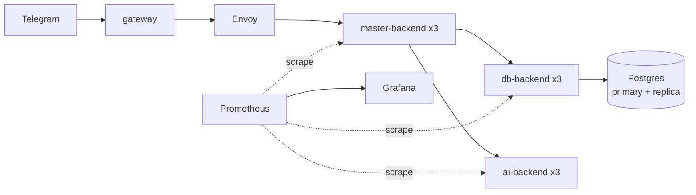

# Taro Bot

Распределённый Telegram-бот для расклада карт Таро, переписанный на Kotlin/JVM с gRPC-коммуникацией между сервисами. Каждый бэкенд отказоустойчиво реплицирован (×3), балансировка нагрузки — через Envoy, наблюдаемость — через Prometheus/Grafana.

## Архитектура

Проект состоит из четырёх сервисов и двух общих библиотек:

| Сервис | Роль | Реплики |
|---|---|---|
| **gateway** | Telegram long-polling клиент; маппит апдейты Telegram на gRPC-запросы к `master-backend` и обратно | 1 |
| **master-backend** | Чистая state machine и оркестрация диалога; полностью **stateless** — состояние живёт в Postgres, а не в памяти инстанса | ×3 |
| **db-backend** | Единая точка доступа к Postgres (primary + streaming-реплика); миграции через Flyway; атомарная функция проверки/списания квоты | ×3 |
| **ai-backend** | Генерация интерпретации расклада через LLM; основной провайдер с горячим fallback на резервный, замена провайдера без рестарта | ×3 |

Общие библиотеки:
- **`libs/resilience`** — deadlines, retry, circuit breaker для всех межсервисных вызовов
- **`libs/observability`** — метрики Prometheus и health-эндпоинты, единые для всех сервисов

Весь стек поднимается одной командой через `docker-compose.yml`: сервисы, Envoy (балансировка между репликами каждого тира), Prometheus и Grafana.



Подробное описание архитектуры — в [`docs/`](./docs).

## Быстрый старт

### Требования
- Docker и Docker Compose
- JDK 21 (если нужно собирать/тестировать локально без Docker)

### Настройка окружения

```bash
cp .env.example .env
```

Заполните `.env` своими значениями:

| Переменная | Назначение |
|---|---|
| `BOT_TOKEN` | Токен Telegram-бота от @BotFather |
| `DAILY_READINGS_LIMIT` | Лимит раскладов на пользователя в сутки (0 — без лимита) |
| `DAILY_LLM_LIMIT` | Лимит обращений к LLM в сутки (расклады + уточнения) |
| `UNLIMITED_USER_IDS` | Telegram ID без лимита, через запятую |
| `ADMIN_USER_IDS` | Telegram ID с доступом к команде `/admin` |
| *(ключи LLM-провайдеров)* | Ключи основного и резервного AI-провайдера |

### Запуск всего стека

```bash
docker compose up -d
```

Это поднимет все 4 сервиса (в нужном количестве реплик), Envoy, Postgres (primary + реплика), Prometheus и Grafana.

Проверить состояние:

```bash
docker compose ps
```

Остановить и убрать стек:

```bash
docker compose down
```

## Разработка

Сборка и тесты:

```bash
./gradlew build test integrationTest
```

`integrationTest` поднимает зависимости (Postgres и др.) через Testcontainers — Docker должен быть запущен.

## Наблюдаемость

- **Prometheus** — метрики со всех сервисов ([`deploy/prometheus`](./deploy/prometheus))
- **Grafana** — готовый дашборд для обзора состояния системы ([`deploy/grafana/provisioning/dashboards`](./deploy/grafana/provisioning/dashboards))
- Health-эндпоинты у каждого сервиса для проверок Envoy/оркестратора

## CI/CD

- GitHub Actions прогоняет `build` + `test` + `integrationTest` на каждый push и pull request ([`.github/workflows`](./.github/workflows))
- Ветка `main` защищена: прямой push запрещён, слияние возможно только через pull request с зелёной проверкой `build-test`

## Структура репозитория

```
.
├── services/           # gateway, master-backend, db-backend, ai-backend
├── libs/                # resilience, observability — общие библиотеки
├── proto/               # контракты gRPC
├── deploy/              # Envoy, Prometheus, Grafana конфиги
├── docs/                # архитектурная документация
├── docker-compose.yml   # весь стек одним файлом
└── .env.example         # шаблон переменных окружения
```
