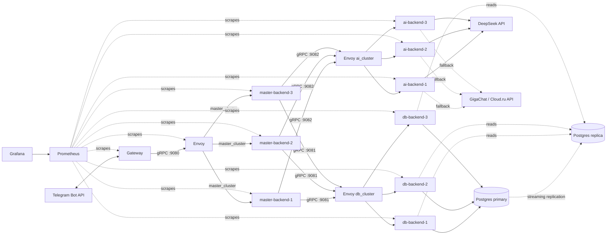

# Architecture

A distributed rewrite of the tarot bot: a Telegram-facing gateway, a stateless
clustered master backend built around an explicit state machine, a clustered
Postgres-backed DB backend, and a clustered AI backend with a runtime-swappable
LLM provider. All inter-service calls are gRPC; all four services are Kotlin/JVM.

## Diagram

Envoy runs three independent listeners (`:9080` master, `:9081` db, `:9082`
ai) — the same three-listener instance serves both gateway→master traffic and
master→db/ai traffic, so the diagram's two "Envoy" boxes are one container.

## Components

### Gateway (`services/gateway`)
Long-polls the Telegram Bot API (`getUpdates`), maps each update to the
`IncomingUpdate` proto, calls `MasterService.HandleUpdate`, and replays the
returned `ResponseAction`s back to Telegram (`sendMessage`/`sendPhoto`/
`editMessageText`/`answerCallbackQuery`). Runs as a **single instance** —
`getUpdates` has one exclusive offset cursor, so replicating this service
would race two pollers against the same cursor. It holds no business logic
and no persistent state; a restart just resumes polling from Telegram's last
acknowledged offset.

### Master backend (`services/master-backend`)
Three stateless replicas behind Envoy. Built around an explicit state
machine:
- `statemachine.StateMachine.transition(state, event)` is a pure function —
  no I/O — mapping a `ConversationState` + `Event` to a new state and a list
  of `Effect`s. This is what's unit-tested exhaustively (39 cases): every
  state/event combination, without mocks.
- `orchestration.MasterOrchestrator` is the only impure layer: loads the
  user's `ConversationState` from db-backend, runs the pure transition,
  executes each `Effect` (quota check, card draw, AI call, image render,
  persistence), and **always writes the resulting state back to Postgres
  before returning** — even on failure paths (e.g. an AI error persists an
  `AwaitingRetry` state rather than silently dropping context).

That last point is what makes the cluster stateless: no conversation state
ever lives only in a replica's memory, so any of the 3 replicas can handle a
user's *next* message. This is proven directly by an integration test that
constructs a **fresh `MasterOrchestrator` instance for every single call** in
a multi-turn conversation (start → new → pick spread → reversed choice →
question → follow-up) — if state leaked into instance memory instead of
Postgres, that test would fail.

Global commands (`/start`, `/new`, `/card`, `/history`, `/stats`, `/admin`,
`/about`, `/help`, `/reset`) always take precedence over whatever state a
conversation is in.

### DB backend (`services/db-backend`)
Three stateless replicas behind Envoy, each holding two Exposed `Database`
handles: **primary** for all writes plus quota/conversation-state reads
(need strict consistency), **replica** for `ListReadings`/`GetDiaryStats`/
`GetBotStats` (can tolerate replication lag). No pgbouncer/pgpool — a single
write node doesn't need one at this scale.

Schema (Flyway, `V1__init.sql` + `V2__quota_function.sql`):
`users`, `user_settings`, `readings` (spread/followups as JSONB), `usage`
(daily per-user counters), `conversation_state`. Quota enforcement is a
single row-locked (`FOR UPDATE`) plpgsql function, `consume_quota(...)`,
called from `CheckAndConsumeQuota` — this makes the check-and-increment
atomic regardless of which replica or how many concurrent callers hit it.
Every replica runs Flyway on startup; Flyway's own schema-history locking
makes concurrent migration attempts safe (whichever replica gets there first
runs it, the others find nothing pending).

Postgres runs as one primary + one streaming-replication replica
(`bitnami/postgresql` images, env-driven replication setup).

### AI backend (`services/ai-backend`)
Three stateless replicas behind Envoy. Wraps two OpenAI-chat-completions-
compatible providers — **DeepSeek** (primary) and **GigaChat/Cloud.ru**
(fallback) — behind one `AiProvider` interface. Two independent fallback
mechanisms:
1. **Automatic per-call fallback**: if the primary provider's own
   retries (Ktor `HttpRequestRetry`, 3 attempts, exponential backoff, on
   5xx/429/timeout) are exhausted, that single request retries once against
   the fallback provider.
2. **Runtime-swappable primary/fallback assignment**: `AiAdminService.
   SetActiveProvider` flips which provider id is primary/fallback without a
   redeploy. Each replica watches its `providers.yaml` config file (shared
   Docker volume) via `java.nio.file.WatchService` and hot-reloads on
   change; a `SetActiveProvider` call updates the caller's own in-memory
   config immediately and best-effort rewrites the shared file so the other
   two replicas' watchers pick it up within a second or two. This bounded
   eventual consistency is an accepted trade-off against adding a
   coordination service (etcd/Consul) purely to keep 3 replicas in lockstep.

Prompts (system prompts, per-spread guardrail blocks, the `max_tokens`
formula) preserve the intent of the original bot's Russian-language
guardrails against false certainty about real people or future events — not
literal ported text, since this is a from-scratch Kotlin implementation.

### Shared libraries
- **`libs/resilience`**: the *only* place any service builds an outbound
  gRPC channel. `ResilientChannelFactory.build(target, policy)` wires a
  per-target deadline, gRPC's native retry (service-config JSON — retryable
  only on `UNAVAILABLE`/`DEADLINE_EXCEEDED`, never on caller errors like
  `INVALID_ARGUMENT`), and a `resilience4j` circuit breaker. `ChannelPolicy`
  ships named presets (`forDbBackend()` 10s deadline, `forAiBackend()` 65s,
  `forMasterBackend()` 15s).
- **`libs/observability`**: one call (`Observability.install(...)`) per
  service wires a Prometheus `MeterRegistry`, a gRPC server metrics
  interceptor, `grpc.health.v1.Health` + reflection services, and a small
  Ktor server exposing `/metrics` and `/healthz`.
- **`libs/config`**: typed env-var helpers (`requiredEnv`, `intEnv`,
  `idSetEnv`, ...) and a YAML config loader, both explicit-map-parameter
  based so they're testable without mutating real process environment.
- **`domain/tarot-domain`** / **`domain/tarot-render`**: the actual tarot
  logic — deck loading, the 6 spread layouts, fuzzy Russian card-name search
  for `/card`, and Java2D spread-image compositing. Master calls these
  directly (no RPC hop) since it's static/local data and pure computation.

### Load balancing (Envoy)
Plain `docker compose` has no k8s-style "N replicas behind a virtual IP"
primitive, so each replicated tier is 3 explicitly named services
(`db-backend-1/2/3`, etc.) listed individually as static endpoints in one of
Envoy's three clusters. Envoy does `ROUND_ROBIN` load balancing and active
`grpc_health_check`-based eviction of unhealthy replicas — and nothing else.
Retries and deadlines are deliberately **not** duplicated at the Envoy layer;
that's `libs/resilience`'s job on the client side. Doing both would risk
retry-storm amplification (a client retry landing on a replica Envoy is
*also* retrying against).

### Observability
Every service exposes Prometheus metrics on its own `/metrics` port (see the
port table below); Envoy exposes `/stats/prometheus` on its admin port.
Prometheus scrapes all of them; Grafana auto-provisions that Prometheus
datasource plus a starter dashboard.

| Service | gRPC port | Metrics port |
|---|---|---|
| gateway | 9100 (health/reflection only) | 9101 |
| master-backend-1/2/3 | 9090 | 9190 |
| db-backend-1/2/3 | 9091 | 9191 |
| ai-backend-1/2/3 | 9092 | 9192 |
| envoy | 9080 / 9081 / 9082 (+9901 admin) | — |
| postgres primary / replica | 5432 (internal only) | — |
| prometheus | — | 9099 (host) |
| grafana | — | 3000 |

## Proto contracts

Four `.proto` files under `proto/src/main/proto/`:

- **`common.proto`**: shared messages — `Card`, `SpreadCard`, `InlineKeyboard`, `Error`.
- **`gateway_master.proto`** (`tarotbot.gateway`): `MasterService.HandleUpdate(IncomingUpdate) → OutgoingResponse`.
  `IncomingUpdate` carries the Telegram chat/user identity plus a `oneof {text_message, callback_data}`.
  `OutgoingResponse` is a list of `ResponseAction`s, each a `oneof {TextAction, PhotoAction, EditMessageAction, AnswerCallbackAction}`.
- **`master_db.proto`** (`tarotbot.db`): `DbService` — user profile, conversation state (`Get/SaveConversationState`,
  optimistic-locked via a `version` field), quota (`CheckAndConsumeQuota`, `GetUsage`), readings/diary
  (`SaveReading`, `AppendFollowup`, `GetReading`, `ListReadings`, `SetReadingNote`, `SetReadingResonance`, `GetDiaryStats`),
  settings (`Get/SetReversedCardsPreference`), and `/admin` (`GetBotStats`).
- **`master_ai.proto`** (`tarotbot.ai`): `AiService` — the three interpretation shapes (`InterpretSpread`,
  `AnswerFollowup`, `InterpretClarifyingCard`), each returning `InterpretationResponse{text, truncated, provider_used}`.
  `AiAdminService` — `SetActiveProvider`/`GetProviderStatus` for the runtime provider swap.

## Testing

- **Unit** (kotest + mockk): pure logic only — the state machine (39 cases,
  zero mocks since `transition()` takes no dependencies), deck/spread/fuzzy-
  search logic, resilience policy objects, prompt/`max_tokens` builders,
  Telegram↔proto mapping.
- **Integration** (`src/integrationTest/kotlin`, a Gradle source set added by
  a shared `buildSrc` convention plugin): db-backend against a real
  Testcontainers Postgres + Flyway + in-process gRPC; ai-backend against
  Ktor `MockEngine` (primary success / primary-fails-then-fallback /
  both-fail / real file-watch hot-reload); master-backend against
  hand-written in-memory `DbService`/`AiService` stubs over in-process gRPC,
  driving full multi-turn conversations through fresh orchestrator instances
  to prove statelessness.
- CI (`.github/workflows/ci.yml`) runs `./gradlew build test integrationTest`
  on every push/PR to `main`; branch protection requires this check to pass
  before merge.

## Runtime topology (`docker compose up`)

`postgres-primary` + `postgres-replica` (streaming replication) →
`db-backend-1/2/3` (each runs Flyway on startup) + `ai-backend-1/2/3`
(sharing an `ai_backend_config` volume for the hot-reloadable provider
config) → `envoy` (fronts both tiers plus the master tier) →
`master-backend-1/2/3` → `gateway` (single instance) → `prometheus` →
`grafana`. Compose's `depends_on` conditions (`service_healthy` for
Postgres, plain start-order otherwise) sequence the bring-up; Envoy's active
health checks handle the remaining "is it actually ready yet" gap once a
replica's process has started but its gRPC server hasn't bound yet.
