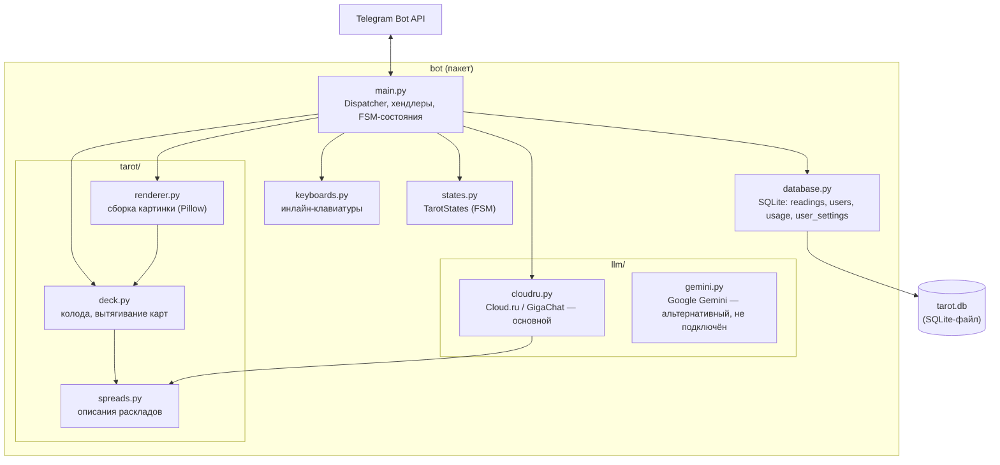

# Архитектура

Telegram-бот «личный AI-таролог» на [aiogram 3](https://docs.aiogram.dev/)
(long polling), без веб-сервера и без внешних очередей — один процесс
Python, который держит соединение с Telegram Bot API и синхронно (через
`asyncio.to_thread`) обращается к SQLite и внешнему LLM.

## Компоненты

- **`bot/main.py`** — единственная точка входа в бизнес-логику: регистрирует
  хендлеры aiogram, middleware, глобальный обработчик ошибок и запускает
  polling (`bot/__main__.py` → `python -m bot`).
- **`bot/tarot/`** — предметная область, не знает про Telegram: колода из
  78 карт (`cards.json` + `deck.py`), описания 6 раскладов (`spreads.py`),
  сборка карт в одну картинку (`renderer.py`, Pillow).
- **`bot/llm/`** — интеграция с LLM-провайдером. Промпт строится с учётом
  позиций карт, переворотов и специальных правил конкретного расклада.
  `cloudru.py` (Cloud.ru Foundation Models, модель GigaChat) — тот, что
  реально используется ботом; `gemini.py` реализован полностью (с ретраями
  на 503), но пока не подключён к `main.py`.
- **`bot/database.py`** — единственное постоянное хранилище: SQLite-файл,
  путь настраивается через `DATABASE_PATH` (по умолчанию `data/tarot.db`).

## Слои

| Слой | Файлы | Ответственность |
|---|---|---|
| Presentation | `keyboards.py`, форматирование текста в `main.py` (`format_*`, `send_llm_response`, `llm_to_html`) | Инлайн-клавиатуры, HTML-разметка, разбиение длинных ответов на сообщения (лимит Telegram — 4096 символов) |
| Application | `main.py` (хендлеры), `states.py` | Сценарий диалога на FSM, дневные лимиты (`take_quota`), маршрутизация callback/команд |
| Domain | `tarot/` | Правила колоды и раскладов — не зависят ни от Telegram, ни от LLM, ни от БД |
| Infrastructure | `database.py`, `llm/` | SQLite, внешний HTTP-вызов к LLM-провайдеру |

## Поток запроса: «сделать расклад»

1. `/start` или кнопка «Новый расклад» → FSM переходит в `choosing_spread`,
   пользователь выбирает один из 6 раскладов (`spread_keyboard`).
2. Если у пользователя нет сохранённой настройки «перевёрнутые карты»
   (`user_settings` в БД) — бот спрашивает и умеет запомнить выбор
   (`remember_reversed_cards_choice`).
3. Пользователь пишет вопрос текстом → хендлер `get_question`
   (`main.py`, состояние `waiting_for_question`):
   - `take_quota` проверяет и сразу списывает дневной лимит
     (`DAILY_READINGS_LIMIT` / `DAILY_LLM_LIMIT` в таблице `usage`) —
     списание происходит **до** обращения к модели, чтобы платить за
     попытку, а не за удачный ответ;
   - `tarot.deck.make_spread` вытягивает карты;
   - `tarot.renderer.render_spread` собирает их в одну картинку
     (временный JPG с уникальным именем, удаляется сразу после отправки);
   - `llm.cloudru.interpret_tarot` отправляет карты и вопрос в LLM
     (таймаут 60 с, до 3 попыток на сетевых ошибках);
   - `database.save_reading` сохраняет вопрос, карты и интерпретацию;
   - ответ отправляется пользователю (HTML, порезанный на несколько
     сообщений при необходимости).
4. FSM переходит в `follow_up`: следующее текстовое сообщение
   считается уточняющим вопросом по этому же раскладу
   (`llm.cloudru.answer_followup`, с учётом последних 3 пар
   вопрос/ответ — `MAX_HISTORY_TURNS`).
5. Ошибки на любом из шагов (вытягивание карт, LLM, запись в БД,
   отправка в Telegram) логируются одной строкой метрик
   (`log_metrics`) и не должны приводить к потере уже вытянутых карт —
   пользователю предлагается повтор (`retry_interpretation`).

## Хранение состояния

- **FSM (`MemoryStorage`)** — только в памяти процесса. Переживает
  нажатия кнопок в рамках одного расклада, но **не переживает рестарт
  бота**: старые расклады теряют возможность уточнений и повтора
  интерпретации (бот сообщает об этом явно).
- **SQLite (`data/tarot.db`)** — постоянное хранилище: сами расклады
  (`readings`, с дневником — заметка и отметка «отозвалось»), настройки
  пользователя (`user_settings`), дневные лимиты (`usage`), список
  пользователей для `/admin` (`users`).

## Деплой

- Приложение — один Docker-контейнер (`docker/Dockerfile`), точка входа
  `python -m bot`. SQLite-файл монтируется как volume (`./data:/app/data`),
  секреты — через `.env` (`env_file` в `docker-compose.yml`), не пишутся
  в образ.
- Локальный запуск — `docker compose up -d --build` (см. README).
- CI (`.github/workflows/ci.yml`) на каждый push/PR в `main`: проверка
  импортов (`python -m compileall`) и сборка Docker-образа без публикации —
  ловит поломки раньше, чем они попадут в деплой.
- Деплой на ВМ (`.github/workflows/deploy.yml`) запускается вручную
  (`workflow_dispatch`, кнопка «Run workflow»): GitHub Actions по SSH
  заходит на ВМ и выполняет `git pull && docker compose up -d --build`.
  Реестр контейнеров не используется — ВМ пересобирает образ сама.
